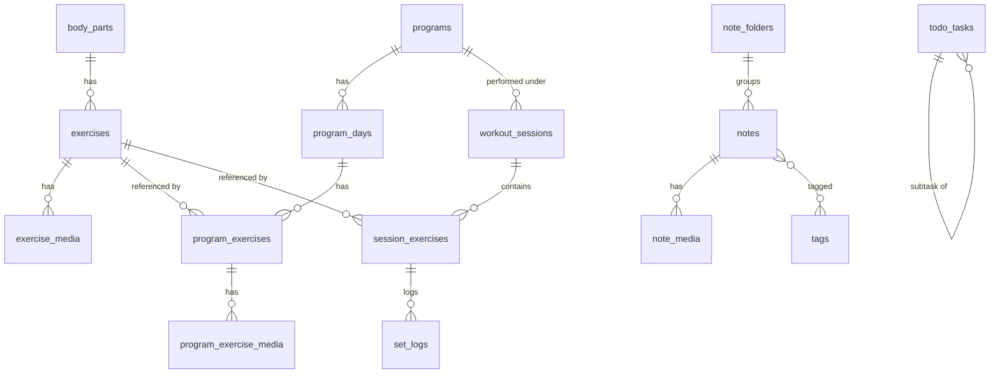

# Data Model

The authoritative schema lives in code: `app/lib/core/database/` (Drift). This document is the human-readable map. **Keep them in sync** — any table change here must match a Drift migration (see [BACKUP_AND_VERSIONING](./BACKUP_AND_VERSIONING.md)).

Conventions:
- User-created entities use a **UUID `id` (text)** so they survive export/import. Pure join/child rows may use auto-increment ints.
- Timestamps stored as **UTC epoch milliseconds** (`int`). **CE (Gregorian) is the standard**; the UI may optionally display BE. Storage and exports are always CE.
- Media (photos, mp4) are **files on disk**; tables store a **relative path**, not the bytes.

---

## 1. Entity overview by feature

### Exercise library
| Table | Key fields | Notes |
|---|---|---|
| `body_parts` | id, name, description, accentColor, coverImagePath, sortOrder | Seeded with the 10 categories in priority order (see note below); user-editable. |
| `exercises` | id, bodyPartId→, name, targetMuscle, steps (text), defaultSets, defaultReps, viewedCount, sortOrder, createdAt, updatedAt | One exercise belongs to one body part. |
| `exercise_media` | id, exerciseId→, type (image\|video), path, sortOrder | Many per exercise → the detail carousel. |

**Body-part categories (seed order):** Chest · Back · Leg · Shoulder · Bicep · Triceps · Abs · Compound · Functional · Stretching. Ordered by priority — large muscles first, then medium (top-down, front-back), then exercise-type categories. Small groups roll up: **Calf** and other lower-leg muscles live under **Leg**; **Forearm** is split by function — flexors under **Bicep**, extensors under **Triceps**. Compound / Functional / Stretching are exercise-type categories rather than single muscles.

### Program
| Table | Key fields | Notes |
|---|---|---|
| `programs` | id, name, description, category (bodybuilding\|bulking\|cutting\|endurance\|custom), coverImagePath, archived, createdAt, updatedAt | |
| `program_days` | id, programId→, dayIndex (1–7), title | e.g. "Day 1 – Chest/Tricep". |
| `program_exercises` | id, programDayId→, exerciseId→ (nullable), customName, plannedSets, plannedReps (text e.g. "12/10/8/6"), restSeconds, note, sortOrder | References a library exercise **or** is a custom entry (own name/media). |
| `program_exercise_media` | id, programExerciseId→, type, path, sortOrder | Only for custom entries; library entries reuse `exercise_media`. |

### Retro (history of actually-performed work)
| Table | Key fields | Notes |
|---|---|---|
| `workout_sessions` | id, performedAt, programId→ (nullable), dayIndex (nullable), title, note, durationSeconds, createdAt | One row per training day shown in Retro. |
| `session_exercises` | id, sessionId→, exerciseId→ (nullable), nameSnapshot, sortOrder | Name snapshotted so history is stable even if the library changes. |
| `set_logs` | id, sessionExerciseId→, setIndex, weightKg, reps, restSeconds, completed | The weight/reps grid. Past sessions for an exercise power the "previous records" overlay. |

### Discipline
| Table | Key fields | Notes |
|---|---|---|
| `todo_tasks` | id, title, note, dueAt (nullable), isAllDay, completed, priority, repeatRule, alertRule (nullable), parentId→ (nullable), sortOrder, createdAt | `parentId` enables sub-tasks (the "0/3" progress). `isAllDay` + `alertRule` inherit the Settings defaults unless overridden — see [SETTINGS_SPEC](./SETTINGS_SPEC.md). |
| `note_folders` | id, module (note\|bodybuilding), name, sortOrder, backgroundImagePath (nullable) | **Separate** folder lists per module, managed in Settings. |
| `notes` | id, folderId→, module (note\|bodybuilding), title, body, pinned, rating, createdAt, updatedAt | Fitness Notes + Bodybuilding share this table, split by `module` + folder. |
| `note_media` | id, noteId→, path, caption, sortOrder | Image gallery for Bodybuilding / note attachments. |
| `tags` | id, module (note\|bodybuilding), name, color | **Separate** tag sets per module, managed in Settings. |
| `note_tags` | noteId→, tagId→ | Many-to-many: a note can have several tags. |
| `alarms` | id, label, timeOfDay (minutes), daysOfWeek (bitmask), repeatRule, enabled, sound, createdAt | Drives `flutter_local_notifications`. |
| `weight_entries` | id, recordedAt, bodyWeightKg, bodyFatPct (nullable), note, photoPath (nullable) | Weight trend recorder + Retro bulk/cut analysis. |

### App
| Table | Key fields | Notes |
|---|---|---|
| `app_settings` | key, value | Key-value store for every adjustable option (locale, calendar CE/BE, theme, text-size mode + scale, image quality, save-to-album, to-do alert defaults, units, last backup/sync time). In the DB so backups capture settings too. Full key list: [SETTINGS_SPEC](./SETTINGS_SPEC.md). |
| `card_appearance` | cardKey, backgroundImagePath (nullable), accentColor (nullable), updatedAt | Per-section/sub-module card look. `cardKey` is stable, e.g. `exercise.abs`, `discipline.todo`, `program.bulking`, `note.folder.<id>`. |

---

## 2. Relationships (ER)

---

## 3. Why two layers of "exercise"

- **`exercises`** = the *library* (Tab 1): the canonical how-to with media and technique.
- **`program_exercises`** = a *placement* of an exercise into a program day, with planned sets/reps and an optional override (custom name/media).
- **`session_exercises` + `set_logs`** = what *actually happened* on a date (Tab 4 / the logging overlay).

This separation is what lets the logging screen show "planned 12/10/8/6" next to "what you did on 26/12/22 and 11/9/19," and lets the library evolve without rewriting history (names are snapshotted into sessions).

---

## 4. Open modelling questions (to confirm later)

- **Supersets / circuits** (the "posterior deltoid-tricep" combo in the design): model as a `groupId` on `program_exercises`? Deferred until Program milestone.
- **Units:** kg only, or kg/lb toggle? Schema stores kg; a Settings flag would convert at the edge.
- **Cardio / duration-only exercises:** `set_logs` already supports `durationSeconds`; confirm UI need during the Program milestone.
